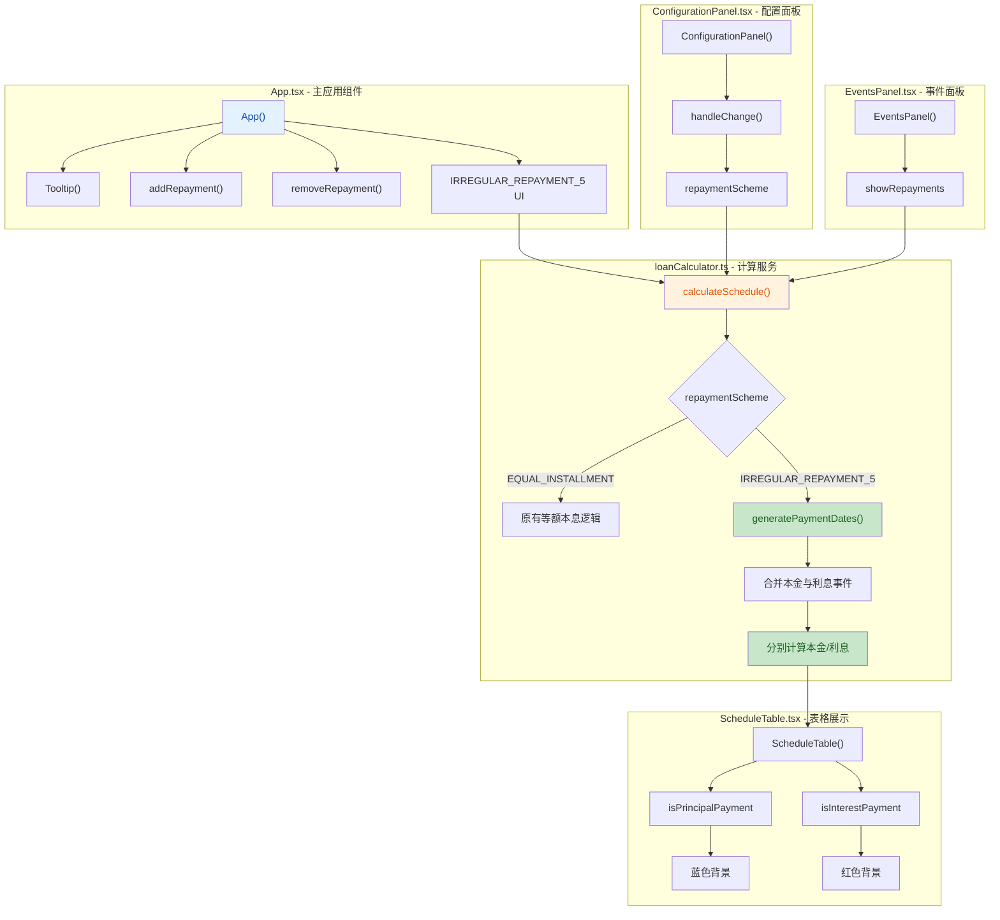
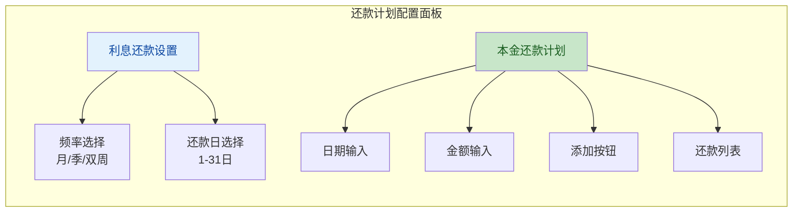

## 1. 高层摘要 (TL;DR)

*   **影响范围:** 高 - 新增了一种全新的还款方案计算逻辑和完整的UI配置界面
*   **核心变更:**
    *   ✨ 新增 **不规则还款5** 方案,支持本金与利息分离还款
    *   🎨 新增还款方案配置面板,支持利息还款频率(月/季/双周)和还款日设置
    *   📊 新增本金还款计划管理功能,支持自定义本金还款日期和金额
    *   🎯 优化还款计划表格展示,本金还款和利息还款使用不同颜色区分
    *   📅 新增贷款到期日KPI卡片展示

---

## 2. 可视化概览 (代码与逻辑映射)



---

## 3. 详细变更分析

### 🎛️ 3.1 类型定义扩展

**文件:** `types.ts`

新增了还款方案相关的类型定义:

| 类型名称 | 值选项 | 说明 |
|---------|--------|------|
| `RepaymentScheme` | `EQUAL_INSTALLMENT` \| `IRREGULAR_REPAYMENT_5` | 还款方案枚举 |
| `InterestPaymentFrequency` | `MONTHLY` \| `QUARTERLY` \| `BIWEEKLY` | 利息还款频率 |

**LoanParams 接口新增字段:**
```typescript
repaymentScheme: RepaymentScheme;           // 还款方案
interestPaymentFrequency: InterestPaymentFrequency; // 利息还款频率
interestPaymentDay: number;                  // 利息还款日期(1-31)
```

**Summary 接口新增字段:**
```typescript
loanEndDate: string;  // 贷款到期日
```

---

### 🧮 3.2 核心计算逻辑重构

**文件:** `services/loanCalculator.ts`

实现了完整的**不规则还款5方案**计算逻辑:

#### 新增核心函数:

1. **`generatePaymentDates()`** - 生成利息还款日期序列
   - 支持每月/每季度/双周频率
   - 根据指定的还款日(1-31)生成日期
   - 自动处理日期边界情况

2. **不规则还款5计算流程:**
   ```mermaid
   flowchart TD
       Start[开始计算] --> Sort[按日期排序本金还款]
       Sort --> GenDates[生成利息还款日期]
       GenDates --> Merge[合并本金和利息事件]
       Merge --> Loop{遍历所有事件}
       Loop --> CalcInterest[计算期间利息]
       CalcInterest --> CheckType{事件类型?}
       CheckType -->|本金| Principal[处理本金还款]
       CheckType -->|利息| Interest[处理利息还款]
       Principal --> UpdateBalance[更新余额]
       Interest --> UpdateBalance
       UpdateBalance --> Next{还有事件?}
       Next -->|是| Loop
       Next -->|否| End[返回结果]
       
       style Start fill:#e3f2fd,color:#0d47a1
       style GenDates fill:#c8e6c9,color:#1a5e20
       style Merge fill:#c8e6c9,color:#1a5e20
       style Principal fill:#fff3e0,color:#e65100
       style Interest fill:#fff3e0,color:#e65100
   ```

#### 关键特性:

- **本金与利息分离:** 本金还款不包含利息,利息单独按频率支付
- **到期日处理:** 贷款到期日自动添加本金还款,确保本金全部还清
- **事件合并:** 将本金还款和利息还款事件按日期排序合并
- **保留原逻辑:** 等额本息方案的计算逻辑完全保留

---

### 🎨 3.3 UI组件增强

#### 3.3.1 主应用组件

**文件:** `App.tsx`

**新增功能:**

| 功能 | 说明 |
|-----|------|
| `Tooltip` 组件 | 悬停提示组件,用于显示帮助信息 |
| `addRepayment()` | 添加本金还款计划 |
| `removeRepayment()` | 删除本金还款计划 |
| `newRepayment` 状态 | 管理新增还款表单数据 |

**新增UI面板 - 还款计划配置:**



**条件渲染逻辑:**
- 仅当 `repaymentScheme === 'IRREGULAR_REPAYMENT_5'` 时显示还款计划配置面板
- `EventsPanel` 的 `showRepayments` 属性根据还款方案动态控制

**KPI卡片扩展:**
- 从3列改为4列布局
- 新增"贷款到期日"卡片(紫色主题)

#### 3.3.2 配置面板组件

**文件:** `components/ConfigurationPanel.tsx`

**新增控件:**

| 控件 | 选项 | 说明 |
|-----|------|------|
| 还款方案选择器 | 等额本息 / 不规则还款5 | 选择还款方案 |

**更新逻辑:**
- `handleChange()` 函数扩展,支持新的字符串类型字段

#### 3.3.3 事件面板组件

**文件:** `components/EventsPanel.tsx`

**新增属性:**
```typescript
showRepayments?: boolean;  // 控制是否显示额外还款部分
```

**条件渲染:**
- 当 `showRepayments = true` 时显示额外还款管理界面
- 不规则还款5方案下,额外还款由专门的还款计划面板管理

#### 3.3.4 表格展示组件

**文件:** `components/ScheduleTable.tsx`

**新增行类型判断:**

| 判断条件 | 样式 | 说明 |
|---------|------|------|
| `isPrincipalPayment` | 蓝色背景 (`bg-blue-50`) | 纯本金还款 |
| `isInterestPayment` | 红色背景 (`bg-red-50`) | 纯利息还款 |

**视觉优化:**
- 本金还款: 蓝色文字 + 蓝色背景
- 利息还款: 红色文字 + 红色背景
- 分段行: 灰色背景,不显示利率

---

### 🌐 3.4 国际化支持

**文件:** `translations.ts`

**新增翻译条目:**

| 英文键 | 中文翻译 | 说明 |
|-------|---------|------|
| `repaymentScheme` | 还款方案 | 还款方案标题 |
| `repaymentSchemeTooltip` | 选择贷款的还款方式 | 提示文本 |
| `straightLine` | 等额本息 | 等额本息方案 |
| `irregularMode5` | 不规则还款5 | 不规则还款5方案 |
| `repaymentPlanConfig` | 还款计划配置 | 配置面板标题 |
| `interestPaymentSettings` | 利息还款设置 | 利息设置标题 |
| `principalRepaymentPlan` | 本金还款计划 | 本金计划标题 |
| `loanEndDate` | 贷款到期日 | KPI卡片标题 |
| `principalRepayment` | 本金还款 | 还款记录备注 |
| `interestRepayment` | 利息还款 | 还款记录备注 |

---

## 4. 影响与风险评估

### ⚠️ 4.1 破坏性变更

| 项目 | 影响 | 说明 |
|-----|------|------|
| `LoanParams` 接口扩展 | 需要更新 | 新增3个必填字段,默认值已在 `App.tsx` 中设置 |
| `Summary` 接口扩展 | 需要更新 | 新增 `loanEndDate` 字段 |
| `EventsPanel` 组件属性 | 向后兼容 | `showRepayments` 为可选属性,默认 `true` |

### 🧪 4.2 测试建议

#### 功能测试:
1. **还款方案切换**
   - [ ] 验证在等额本息和不规则还款5之间切换,UI正确显示/隐藏
   - [ ] 验证切换还款方案后,计算结果正确更新

2. **不规则还款5方案**
   - [ ] 验证利息还款频率(月/季/双周)正确生成日期
   - [ ] 验证利息还款日(1-31)正确设置
   - [ ] 验证本金还款计划的添加和删除功能
   - [ ] 验证贷款到期日自动还清剩余本金和利息

3. **表格展示**
   - [ ] 验证本金还款行显示蓝色背景
   - [ ] 验证利息还款行显示红色背景
   - [ ] 验证分段行不显示利率

4. **边界情况**
   - [ ] 验证无本金还款计划时的默认行为
   - [ ] 验证本金还款金额超过剩余余额的处理
   - [ ] 验证节假日调整对不规则还款的影响

#### 兼容性测试:
- [ ] 验证等额本息方案的原有逻辑不受影响
- [ ] 验证中英文翻译正确显示

---

## 5. 总结

本次变更新增了**不规则还款5方案**的完整支持,包括:

✅ **类型定义扩展** - 新增还款方案相关类型  
✅ **计算逻辑重构** - 实现本金与利息分离的计算引擎  
✅ **UI界面增强** - 新增还款计划配置面板和KPI卡片  
✅ **表格展示优化** - 本金/利息还款使用不同颜色区分  
✅ **国际化支持** - 完整的中英文翻译  

该方案为用户提供了更灵活的还款方式选择,特别适合需要**本金与利息分离还款**的场景(如某些商业贷款产品)。