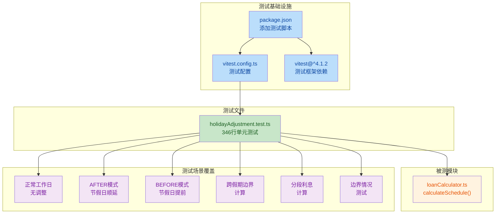
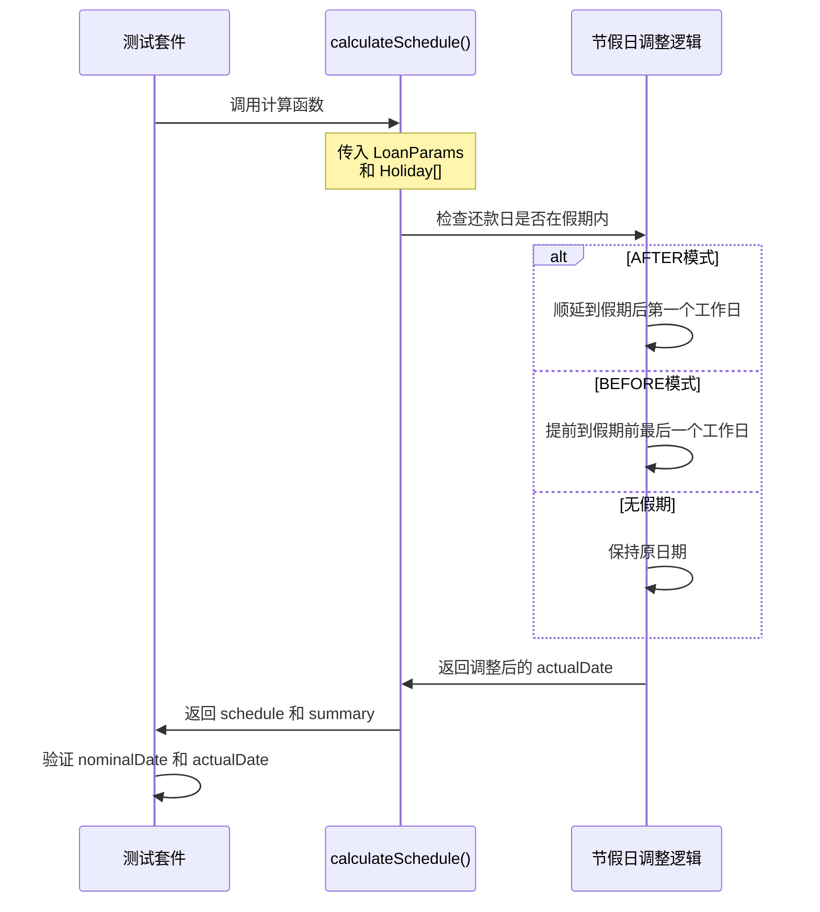

## 1. 高层摘要（TL;DR）

*   **影响：** 🟡 **中等** - 为贷款计算器添加了完整的测试基础设施和节假日调整逻辑的单元测试
*   **关键变更：**
    *   ✅ 集成 **Vitest** 测试框架作为项目的测试工具
    *   ✅ 新增 **346行** 的节假日调整逻辑单元测试
    *   ✅ 配置测试环境和覆盖率报告
    *   ✅ 调整 `package.json` 依赖项顺序

---

## 2. 可视化概览（代码与逻辑图）



**测试流程图：**



---

## 3. 详细变更分析

### 📦 组件一：测试基础设施配置

#### **package.json**

**变更说明：**
- 添加了 **Vitest** 测试框架依赖
- 新增了三个测试相关的 npm 脚本
- 调整了部分依赖项的排序（`date-fns`, `lucide-react`, `react-dom`）

**脚本命令表：**

| 命令 | 说明 |
|------|------|
| `test` | 运行交互式测试（watch 模式） |
| `test:ui` | 启动 Vitest UI 界面 |
| `test:run` | 运行一次性测试（CI 模式） |

**依赖变更表：**

| 包名 | 操作 | 版本 | 说明 |
|------|------|------|------|
| `vitest` | ✨ 新增 | `^4.1.2` | 单元测试框架 |

#### **vitest.config.ts**（新文件）

**变更说明：**
- 创建了全新的 Vitest 配置文件
- 配置全局测试 API（无需手动导入 `describe`, `it`, `expect`）
- 设置测试环境为 `node`
- 配置测试文件匹配模式：`__tests__/**/*.test.ts`
- 启用三种覆盖率报告格式：`text`, `json`, `html`

---

### 🧪 组件二：节假日调整逻辑单元测试

#### **__tests__/unit/holidayAdjustment.test.ts**（新文件）

**变更说明：**
- 创建了完整的节假日调整逻辑单元测试套件
- 共 **346 行** 测试代码
- 覆盖 **7 大测试场景**，共计 **15 个测试用例**

**测试场景概览表：**

| 测试场景 | 测试用例数 | 关键验证点 |
|---------|-----------|-----------|
| **2.1 正常工作日无调整** | 2 | 无假期时，AFTER 和 BEFORE 模式均保持原日期 |
| **2.2 AFTER 模式 - 节假日顺延** | 3 | 春节、元旦、清明假期的顺延逻辑 |
| **2.3 BEFORE 模式 - 节假日提前** | 2 | 春节、元旦假期的提前逻辑 |
| **2.4 跨假期边界计算** | 3 | 多期还款、周末边界处理 |
| **2.5 分段利息计算（跨假期）** | 2 | `daysCount` 和利息计算的准确性 |
| **边界情况测试** | 2 | 连续多个月假期、模式一致性 |
| **周末不被视为假日** | 1 | 周末还款日不调整 |

**关键测试用例详解：**

1. **AFTER 模式 - 春节假期顺延**
   ```typescript
   // 场景：还款日 2024-02-15 在春节假期内（2024-02-09 至 2024-02-17）
   // 预期：actualDate 从 2024-02-15 顺延到 2024-02-18
   expect(installmentFeb!.actualDate).toBe('2024-02-18');
   ```

2. **BEFORE 模式 - 春节假期提前**
   ```typescript
   // 场景：还款日 2024-02-15 在春节假期内
   // 预期：actualDate 提前到 2024-02-08
   expect(installmentFeb!.actualDate).toBe('2024-02-08');
   ```

3. **分段利息计算验证**
   ```typescript
   // AFTER 模式跨春节假期
   // 预期：daysCount 正确计算为 34 天（2024-01-15 到 2024-02-18）
   expect(febSegment!.daysCount).toBe(34);
   ```

**辅助函数：**
```typescript
const getFirstInstallment = (schedule: any[]) => 
  schedule.find(row => row.type === 'INSTALLMENT');

const getInstallmentByNominalDate = (schedule: any[], nominalDate: string) =>
  schedule.find(row => row.type === 'INSTALLMENT' && row.nominalDate === nominalDate);
```

---

## 4. 影响与风险评估

### ✅ 积极影响
- **提升代码质量**：通过单元测试确保节假日调整逻辑的正确性
- **便于回归测试**：未来修改贷款计算逻辑时，可以快速验证是否破坏现有功能
- **文档化业务逻辑**：测试用例清晰地展示了节假日调整的业务规则

### ⚠️ 风险点
- **无破坏性变更**：本次变更仅添加测试代码，不影响生产环境逻辑
- **依赖版本锁定**：Vitest 版本锁定为 `^4.1.2`，需确保与项目其他依赖兼容

### 🧪 测试建议

**建议测试场景：**
1. ✅ 运行 `npm run test` 验证所有测试用例通过
2. ✅ 运行 `npm run test:run` 确保在 CI 环境中正常运行
3. ✅ 检查覆盖率报告，确保核心逻辑覆盖率达到预期
4. ✅ 验证测试数据中的节假日日期是否准确（如春节、元旦等）

**验证命令：**
```bash
# 运行测试
npm run test

# 生成覆盖率报告
npm run test:run -- --coverage

# 启动 UI 界面
npm run test:ui
```

---

## 5. 总结

本次变更主要为 **LoanProCalculator** 项目添加了完整的测试基础设施，重点针对 **节假日调整逻辑** 编写了详尽的单元测试。测试覆盖了 `AFTER` 和 `BEFORE` 两种调整模式的各种边界情况，包括跨假期计算、分段利息计算等复杂场景。这将大大提升代码的可维护性和可靠性。