## 1. 高层摘要 (TL;DR)

**影响范围:** 🟢 **低** - 纯测试代码和文档新增，不涉及生产代码变更

**核心变更:**
- ✨ 新增 `irregularRepayment5.test.ts` 单元测试文件（520行），覆盖不规则还款5功能的7大测试场景
- 📝 新增 `irregular-repayment-5.md` 测试文档（510行），详细记录测试用例和预期结果
- 🧪 使用 Vitest 框架，测试利息还款频率、本金还款计划、到期日处理、利息计算、边界情况和国际化

---

## 2. 可视化概览 (代码与逻辑映射)

```mermaid
graph TD
    subgraph "测试文件: irregularRepayment5.test.ts"
        A["测试套件入口<br/>describe('不规则还款5测试')"]
        
        subgraph "测试场景 1: 利息还款频率"
            B1["1.1 每月利息还款<br/>it('每月15日利息还款')"]
            B2["1.2 每季度利息还款<br/>it('每季度15日利息还款')"]
            B3["1.3 双周利息还款<br/>it('每两周利息还款')"]
        end
        
        subgraph "测试场景 2: 本金还款计划"
            C1["2.1 单期本金还款<br/>it('6月15日还款5000')"]
            C2["2.2 多期本金还款<br/>it('3、6、9月各还款3000')"]
            C3["2.3 本金还款等于贷款金额<br/>it('6月15日还清全部本金')"]
        end
        
        subgraph "测试场景 3: 贷款到期日处理"
            D1["3.1 到期日自动还清<br/>it('到期日还清剩余本金和利息')"]
            D2["3.2 无本金还款计划<br/>it('到期日一次性还清')"]
            D3["3.3 本金还款覆盖全部期限<br/>it('到期日只需支付利息')"]
        end
        
        subgraph "测试场景 4: 利息计算准确性"
            E1["4.1 每月利息计算<br/>it('验证每月利息计算准确性')"]
            E2["4.2 本金减少后利息重新计算<br/>it('利息基于剩余本金计算')"]
            E3["4.3 跨假期利息计算<br/>it('春节假期期间计算正确')"]
        end
        
        subgraph "测试场景 5: 还款计划表展示"
            F1["5.1 颜色区分<br/>it('验证不同类型还款的备注')"]
            F2["5.2 日期格式<br/>it('验证中文界面的日期格式')"]
        end
        
        subgraph "测试场景 6: 边界情况"
            G1["6.1 利息还款日为31日<br/>it('处理非31日月份')"]
            G2["6.2 起息日等于利息还款日<br/>it('第一期从下月开始')"]
            G3["6.3 本金还款等于利息还款日<br/>it('分别处理同一天还款')"]
            G4["6.4 本金还款在假期期间<br/>it('顺延处理')"]
        end
        
        subgraph "测试场景 7: 国际化支持"
            H1["7.1 英文界面<br/>it('验证英文备注信息')"]
            H2["7.2 中文界面<br/>it('验证中文备注信息')"]
        end
    end
    
    subgraph "文档文件: irregular-repayment-5.md"
        Z["测试文档<br/>包含所有测试场景的<br/>输入输出表格和说明"]
    end
    
    subgraph "被测试的核心服务"
        S["calculateSchedule()<br/>services/loanCalculator"]
    end
    
    A --> B1 & B2 & B3
    A --> C1 & C2 & C3
    A --> D1 & D2 & D3
    A --> E1 & E2 & E3
    A --> F1 & F2
    A --> G1 & G2 & G3 & G4
    A --> H1 & H2
    
    B1 & B2 & B3 & C1 & C2 & C3 & D1 & D2 & D3 & E1 & E2 & E3 & F1 & F2 & G1 & G2 & G3 & G4 & H1 & H2 --> S
    B1 & B2 & B3 & C1 & C2 & C3 & D1 & D2 & D3 & E1 & E2 & E3 & F1 & F2 & G1 & G2 & G3 & G4 & H1 & H2 -.-> Z
    
    style A fill:#e3f2fd,color:#0d47a1
    style S fill:#fff3e0,color:#e65100
    style Z fill:#f3e5f5,color:#7b1fa2
```



---

## 3. 详细变更分析

### 3.1 测试文件 (`__tests__/unit/irregularRepayment5.test.ts`)

**变更类型:** 🆕 新增文件

**核心功能:** 为 **不规则还款5（IRREGULAR_REPAYMENT_5）** 还款方案创建完整的单元测试套件

**测试覆盖的7大场景:**

| 场景编号 | 测试类别 | 测试用例数 | 关键验证点 |
|---------|---------|-----------|-----------|
| **1** | 利息还款频率配置 | 3 | MONTHLY、QUARTERLY、BIWEEKLY 三种频率 |
| **2** | 本金还款计划管理 | 3 | 单期、多期、全额还款 |
| **3** | 贷款到期日处理 | 3 | 自动还清、一次性还清、覆盖全部期限 |
| **4** | 利息计算准确性 | 3 | 每月利息、本金减少后、跨假期 |
| **5** | 还款计划表展示 | 2 | 颜色区分、日期格式 |
| **6** | 边界情况测试 | 4 | 31日、起息日冲突、同日还款、假期顺延 |
| **7** | 国际化支持 | 2 | 英文界面、中文界面 |

**基础测试参数:**

```typescript
const BASE_PARAMS: LoanParams = {
  amount: 10000,
  initialRate: 5.0,
  tenureMonths: 12,
  startDate: '2024-01-01',
  dayCountConvention: 365,
  holidayShiftMode: 'AFTER',
  adjustmentStrategy: 'CHANGE_INSTALLMENT',
  repaymentScheme: 'IRREGULAR_REPAYMENT_5',  // 核心测试对象
  interestPaymentFrequency: 'MONTHLY',
  interestPaymentDay: 15
};
```

**关键测试逻辑:**

1. **利息还款验证** (来源: 第40-66行)
   - 验证每月15日利息还款，本金为0
   - 验证到期日还清全部本金和利息
   - 验证余额计算正确

2. **本金还款验证** (来源: 第138-151行)
   - 验证本金还款时利息为0
   - 验证剩余余额正确减少
   - 验证后续利息基于剩余本金计算

3. **边界情况处理** (来源: 第399-497行)
   - 利息还款日为31日（处理非31日月份）
   - 起息日等于利息还款日（第一期从下月开始）
   - 同一天同时有本金和利息还款（分别处理）
   - 本金还款日在假期期间（顺延处理）

4. **国际化验证** (来源: 第500-524行)
   - 英文界面: "Interest Repayment", "Principal Repayment"
   - 中文界面: "利息还款", "本金还款"

---

### 3.2 测试文档 (`docs/test/irregular-repayment-5.md`)

**变更类型:** 🆕 新增文件

**文档结构:**

| 章节 | 内容 | 行数 |
|------|------|------|
| 测试概述 | 功能说明和测试目标 | 1-11 |
| 基础参数 | 测试用的 LoanParams 配置 | 13-28 |
| 测试场景分类 | 7大场景的详细说明 | 30-465 |
| 测试框架与工具 | Vitest、TypeScript、date-fns | 472-478 |
| 测试结论 | 测试覆盖总结 | 480-492 |
| 测试环境 | Node.js、Vite | 494-500 |
| 运行测试 | npm test 命令 | 502-509 |

**文档特色:**

- 📊 包含详细的输入输出表格
- 🧮 展示利息计算公式（如：`10000 × 5% × 15/365 = 20.55`）
- 🎨 说明UI展示的颜色区分（红色背景=利息还款，蓝色背景=本金还款）
- 🌍 完整的中英文对照

---

## 4. 影响与风险评估

### ⚠️ 破坏性变更

**无** - 本次变更仅为测试代码和文档的添加，不涉及生产代码修改

### ✅ 测试建议

**建议测试场景:**

1. **运行测试套件**
   ```bash
   npm test -- __tests__/unit/irregularRepayment5.test.ts
   ```

2. **验证被测服务存在**
   - 确认 `services/loanCalculator.ts` 中的 `calculateSchedule` 函数已实现
   - 确认 `types/index.ts` 中定义了 `IRREGULAR_REPAYMENT_5` 类型

3. **测试数据验证**
   - 验证测试中的预期利息计算值是否准确
   - 例如：1月15日利息 `19.18` = `10000 × 5% × 14/365` (从1月1日到1月15日共14天)

4. **边界情况覆盖**
   - 验证31日还款在2月（28/29天）的处理
   - 验证假期顺延逻辑是否正确
   - 验证同一天本金和利息还款的合并逻辑

### 📊 测试覆盖率预期

| 测试类别 | 预期覆盖率 |
|---------|-----------|
| 利息还款频率 | 100% (3/3) |
| 本金还款计划 | 100% (3/3) |
| 贷款到期日处理 | 100% (3/3) |
| 利息计算准确性 | 100% (3/3) |
| 还款计划表展示 | 100% (2/2) |
| 边界情况 | 100% (4/4) |
| 国际化支持 | 100% (2/2) |
| **总计** | **100% (20/20)** |

---

## 5. 总结

本次变更是一次**纯测试增强**，为 LoanProCalculator 项目的"不规则还款5"功能添加了：

- 🧪 **520行**全面的单元测试代码
- 📚 **510行**详细的测试文档
- ✅ **20个**测试用例，覆盖7大场景
- 🌍 **中英文**国际化测试支持

这些测试将确保不规则还款5功能在以下方面的正确性：
- 利息还款频率配置（每月/每季度/双周）
- 本金还款计划管理（单期/多期/全额）
- 贷款到期日自动还清逻辑
- 利息计算的准确性
- 各种边界情况的处理
- 国际化显示

**风险等级:** 🟢 **极低** - 不影响现有功能，仅增强测试覆盖