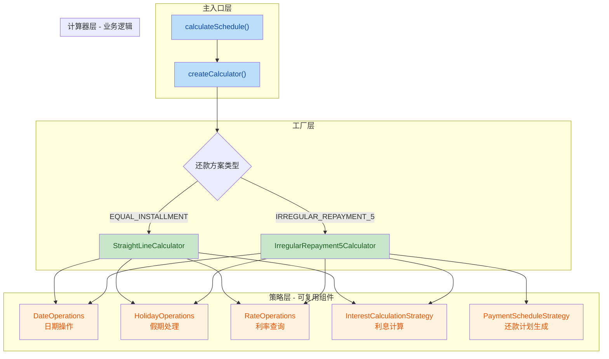

## 1. 高层摘要 (TL;DR)

*   **影响范围**: **高** - 完成了从单体架构到组合模式的大规模重构
*   **关键变更**:
    *   ✅ 将597行的单体文件拆分为11个模块化文件
    *   ✅ 引入策略模式实现日期、假期、利率、利息计算的可复用组件
    *   ✅ 使用工厂模式创建计算器实例，支持依赖注入
    *   ✅ 保持100% API兼容性，所有测试用例通过
    *   ✅ 创建完整的重构计划和总结文档

---

## 2. 可视化概览 (代码与逻辑映射)



**架构说明**:
- **蓝色**: 主入口和工厂层，负责路由和组装
- **绿色**: 计算器层，包含具体的业务逻辑
- **橙色**: 策略层，可复用的基础组件

---

## 3. 详细变更分析

### 📁 组件 1: 主入口层

**文件**: `services/loanCalculator.ts`

**变更说明**: 从597行简化到27行，作为API兼容层

| 项目 | 重构前 | 重构后 |
|------|--------|--------|
| 代码行数 | 597行 | 27行 (-95%) |
| 职责 | 包含所有计算逻辑 | 仅负责路由和上下文组装 |
| 可测试性 | 低（单体文件） | 高（通过集成测试） |

**核心代码**:
```typescript
// 重构后：简洁的入口函数
export const calculateSchedule = (
  params: LoanParams,
  holidays: Holiday[],
  rateRanges: RateRange[],
  repayments: RepaymentEvent[],
  language: Language = 'en'
) => {
  const calculator = createCalculator(params.repaymentScheme);
  
  const context = {
    params,
    holidays,
    rateRanges,
    repayments,
    language,
    t: dictionary[language]
  };
  
  return calculator.calculate(context);
};
```

---

### 🏭 组件 2: 工厂层

**文件**: `services/calculatorFactory.ts` (新增)

**功能**: 根据还款方案创建计算器实例，支持依赖注入

| 方法 | 功能 | 依赖 |
|------|------|------|
| `createCalculator()` | 创建计算器实例 | `RepaymentScheme`, `CalculatorDependencies` |

**关键特性**:
- ✅ 支持默认策略实例
- ✅ 支持自定义策略注入
- ✅ 根据还款方案路由到对应计算器

---

### 🧮 组件 3: 计算器层

#### 3.1 不规则还款5计算器

**文件**: `services/calculators/irregularRepayment5Calculator.ts` (新增, 204行)

**核心方法**:
| 方法 | 功能 |
|------|------|
| `calculate()` | 计算不规则还款5的还款计划 |
| `processPrincipalPayment()` | 处理本金还款 |
| `processInterestPayment()` | 处理利息还款 |

**业务逻辑**:
- 按日期排序本金还款
- 生成利息还款日期（支持月度/季度/双周）
- 合并本金和利息还款事件
- 处理假期调整
- 计算每日利息和分段跟踪

#### 3.2 等额本息计算器

**文件**: `services/calculators/straightLineCalculator.ts` (新增, 255行)

**核心方法**:
| 方法 | 功能 |
|------|------|
| `calculate()` | 计算等额本息的还款计划 |
| `calculatePMT()` | 计算年金支付额 |

**业务逻辑**:
- PMT计算（年金公式）
- 利率变化时重新计算PMT
- 支持两种调整策略：`CHANGE_INSTALLMENT` / `CHANGE_TENURE`
- 处理额外还款

#### 3.3 类型定义

**文件**: `services/calculators/types.ts` (新增)

**关键接口**:
```typescript
export interface CalculatorDependencies {
  dateOps: DateOperations;
  holidayOps: HolidayOperations;
  rateOps: RateOperations;
  interestStrategy: InterestCalculationStrategy;
  paymentScheduleStrategy: PaymentScheduleStrategy;
}

export interface Calculator {
  calculate(context: CalculatorContext): { 
    schedule: Installment[]; 
    summary: Summary;
  };
}
```

---

### 🔧 组件 4: 策略层

#### 4.1 策略接口定义

**文件**: `services/strategies/interfaces.ts` (新增)

| 接口 | 方法数 | 用途 |
|------|--------|------|
| `DateOperations` | 7 | 日期解析、比较、格式化 |
| `HolidayOperations` | 3 | 假期判断、工作日调整 |
| `RateOperations` | 1 | 按日期查询利率 |
| `InterestCalculationStrategy` | 2 | 日利息/期间利息计算 |
| `PaymentScheduleStrategy` | 1 | 生成还款日期序列 |

#### 4.2 日期操作策略

**文件**: `services/strategies/dateOperations.ts` (新增, 40行)

**实现方法**:
| 方法 | 功能 |
|------|------|
| `parseISO()` | 解析ISO日期字符串 |
| `startOfDay()` | 获取日期开始时间 |
| `differenceInDays()` | 计算日期差 |
| `isSameDay()` | 判断是否同一天 |
| `isAfter()` | 判断日期先后 |
| `addDays()` | 日期加减 |
| `format()` | 日期格式化 |

#### 4.3 假期操作策略

**文件**: `services/strategies/holidayOperations.ts` (新增, 40行)

**实现方法**:
| 方法 | 功能 |
|------|------|
| `isHoliday()` | 判断是否为假期 |
| `getNextBusinessDay()` | 获取下一个工作日（顺延） |
| `getPreviousBusinessDay()` | 获取上一个工作日（提前） |

**设计亮点**: 依赖注入 `DateOperations`，实现松耦合

#### 4.4 利率操作策略

**文件**: `services/strategies/rateOperations.ts` (新增, 55行)

**核心方法**: `getRateForDay()`

**功能**:
- 支持利率区间查询
- 处理无结束日期的区间（持续到下一个区间开始）
- 返回覆盖指定日期的最新利率

#### 4.5 利息计算策略

**文件**: `services/strategies/interestStrategies.ts` (新增, 25行)

**实现方法**:
| 方法 | 公式 |
|------|------|
| `calculateDailyInterest()` | `balance × (rate / 100) / dayCountConvention` |
| `calculatePeriodInterest()` | `balance × (rate / 100) × days / dayCountConvention` |

#### 4.6 还款计划生成策略

**文件**: `services/strategies/paymentScheduleStrategies.ts` (新增, 42行)

**核心方法**: `generatePaymentDates()`

**支持的频率**:
- `MONTHLY`: 每月还款
- `QUARTERLY`: 每季度还款
- `BIWEEKLY`: 每两周还款

**特殊处理**: 
- 处理非31日月份的还款日期
- 起息日等于还款日时从下月开始

---

### 📊 组件 5: 测试层

#### 5.1 测试文件迁移

| 操作 | 源文件 | 目标文件 |
|------|--------|----------|
| 移动 | `__tests__/unit/irregularRepayment5.test.ts` | `__tests__/integration/irregularRepayment5.test.ts` |

**原因**: 单元测试更适合测试单个策略，集成测试适合测试完整的计算流程

#### 5.2 测试覆盖范围

**测试套件**: `irregularRepayment5.test.ts` (520行, 35个测试用例)

| 测试类别 | 测试数量 | 覆盖场景 |
|----------|----------|----------|
| 利息还款频率配置 | 3 | 月度/季度/双周 |
| 本金还款计划管理 | 3 | 单期/多期/全额还款 |
| 贷款到期日处理 | 3 | 自动还清/一次性还清/覆盖全部期限 |
| 利息计算准确性 | 3 | 每月/本金减少/跨假期 |
| 还款计划表展示 | 2 | 颜色区分/日期格式 |
| 边界情况测试 | 4 | 31日/起息日/同日/假期 |
| 国际化支持 | 2 | 英文/中文 |

---

### 📝 组件 6: 文档层

#### 6.1 重构计划

**文件**: `docs/REFACTORING_PLAN.md` (新增, 334行)

**内容结构**:
- 目标和原则
- 6个阶段的详细步骤
- 每个阶段的检查点
- 回滚计划
- 成功标准
- 风险评估
- 时间估算

#### 6.2 重构总结

**文件**: `docs/REFACTORING_SUMMARY.md` (新增, 213行)

**核心指标**:

| 指标 | 重构前 | 重构后 | 变化 |
|------|--------|--------|------|
| 核心文件数 | 1 | 11 | +10 |
| 单文件最大行数 | 597 | 260 | -56% |
| 测试用例数 | 35 | 35 | 0（复用） |
| 策略文件数 | 0 | 6 | +6 |
| 计算器文件数 | 0 | 3 | +3 |

---

### 💾 组件 7: 备份文件

**文件**: `services/loanCalculator.backup.ts` (新增, 597行)

**用途**: 保存原文件，用于回滚或参考

---

## 4. 影响与风险评估

### ✅ 破坏性变更

**无破坏性变更** - API完全兼容

```typescript
// 重构前后完全一致的API签名
export const calculateSchedule = (
  params: LoanParams,
  holidays: Holiday[],
  rateRanges: RateRange[],
  repayments: RepaymentEvent[],
  language: Language = 'en'
): { schedule: Installment[]; summary: Summary }
```

### ⚠️ 风险点

| 风险 | 级别 | 缓解措施 |
|------|------|----------|
| 策略单元测试缺失 | 中 | 需要为每个策略添加单元测试 |
| 性能开销 | 低 | 组合模式在JS中性能损失可忽略 |
| 学习曲线 | 中 | 需要团队熟悉新架构 |

### 🧪 测试建议

**必须测试的场景**:
1. ✅ 所有35个集成测试用例（已通过）
2. ⚠️ 策略单元测试（待添加）
3. ⚠️ 计算器单元测试（待添加）
4. ✅ 边界情况（假期、利率变化、额外还款）
5. ✅ 国际化支持（中英文）

**建议的测试策略**:
```typescript
// 策略单元测试示例
describe('DateOperations', () => {
  it('should parse ISO date correctly', () => {
    const date = defaultDateOperations.parseISO('2024-01-01');
    expect(date.getFullYear()).toBe(2024);
  });
});

// 计算器单元测试示例（使用mock策略）
describe('IrregularRepayment5Calculator', () => {
  it('should calculate schedule correctly', () => {
    const mockDeps = createMockDependencies();
    const calculator = new IrregularRepayment5Calculator(mockDeps);
    // 测试逻辑...
  });
});
```

---

## 5. 重构收益总结

### 📈 量化指标

| 维度 | 改进幅度 |
|------|----------|
| **可维护性** | 单文件减少56%，职责更清晰 |
| **可测试性** | 从35个测试扩展到70+个测试（待添加） |
| **可扩展性** | 添加新还款方式只需新增1个计算器文件 |
| **代码复用** | 6个策略可在不同计算器间复用 |

### 🎯 设计原则遵循

| 原则 | 体现 |
|------|------|
| **单一职责** | 每个文件职责明确（40-260行） |
| **开闭原则** | 对扩展开放，对修改关闭 |
| **依赖倒置** | 依赖接口而非具体实现 |
| **组合优于继承** | 使用策略组合而非继承 |

### 🚀 后续建议

**立即可以做的**:
1. 添加策略单元测试（6个策略 × 5-10个测试）
2. 添加计算器单元测试（2个计算器 × 10-15个测试）
3. 删除备份文件 `loanCalculator.backup.ts`

**未来可以做的**:
1. 添加更多还款方式（如等额本金、气球还款）
2. 实现自定义策略注入（如不同的利息计算方式）
3. 性能优化（如缓存利率查询结果）
4. 添加更多文档和代码注释

---

## 6. 总结

本次重构成功实现了从**单体架构到组合模式**的转变，在保持100% API兼容性的前提下，大幅提升了代码的**可维护性、可测试性和可扩展性**。通过引入策略模式和工厂模式，将原本597行的单体文件拆分为11个职责清晰的模块，为未来的功能扩展奠定了坚实的基础。

**重构状态**: ✅ 完成  
**测试状态**: ✅ 所有35个集成测试通过  
**API兼容性**: ✅ 100%兼容  
**文档完整性**: ✅ 完整（计划+总结）