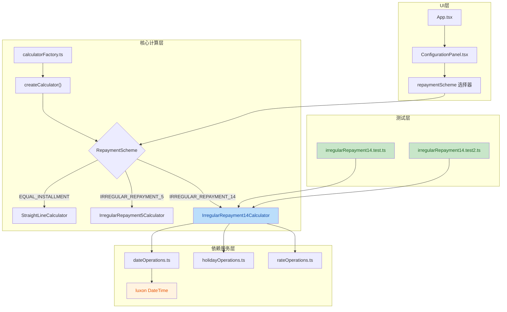
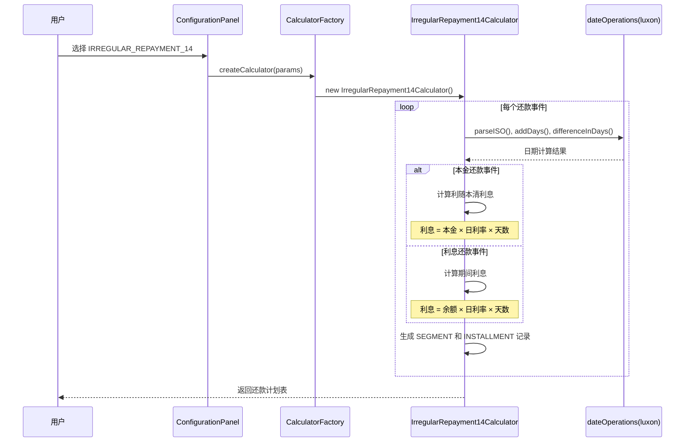

## 1. 高层摘要 (TL;DR)

*   **影响范围**: 🟢 **中等** - 新增还款计算策略，升级日期处理库
*   **核心变更**:
    *   ✨ 新增 **不规则还款14 (IRREGULAR_REPAYMENT_14)** 模式，实现"利随本清"功能
    *   🔄 日期处理库从 **date-fns** 迁移到 **luxon**
    *   🏭 工厂模式注册新计算器
    *   🧪 新增完整集成测试覆盖

---

## 2. 可视化概览 (代码与逻辑映射)



### 不规则还款14 计算流程



---

## 3. 详细变更分析

### 📦 3.1 依赖管理

| 包名 | 旧版本 | 新版本 | 变更说明 |
|------|--------|--------|----------|
| date-fns | ^4.1.0 | - | ❌ 移除 |
| luxon | - | ^3.7.2 | ✅ 新增 |

**迁移原因**: luxon 提供更强大的时区支持和更简洁的 API，适合复杂的日期计算场景。

---

### 🏗️ 3.2 核心计算器实现

#### 新增文件: `services/calculators/irregularRepayment14Calculator.ts`

**核心特性**:
- **利随本清机制**: 本金还款时仅计算对应本金的利息（从上一次利息还款日到本金还款日）
- **分段利息计算**: 支持利率变化时的分段记录
- **灵活还款事件**: 支持定期利息还款 + 不定期本金还款

**关键算法**:

```typescript
// 利随本清计算逻辑
if (event.type === 'PRINCIPAL') {
  principalPayment = event.amount;
  const dailyRate = params.initialRate / 100 / params.dayCountConvention;
  const dailyInterest = principalPayment * dailyRate;
  interestPayment = dailyInterest * daysCount; // 仅计算本金的利息
}
```

**状态管理**:
- `currentBalance`: 当前剩余本金
- `previousDate`: 上一次利息还款日（用于计算天数）
- `totalInterest`: 累计利息

---

### 📅 3.3 日期操作重构

#### 文件: `services/strategies/dateOperations.ts`

| 方法 | date-fns 实现 | luxon 实现 |
|------|--------------|------------|
| `parseISO()` | 手动解析 | `DateTime.fromISO(dateStr).toJSDate()` |
| `differenceInDays()` | `differenceInDays(d1, d2)` | `Math.round(d1.diff(d2, 'days').days)` |
| `isSameDay()` | `isSameDay(d1, d2)` | `d1.hasSame(d2, 'day')` |
| `addDays()` | `addDays(date, days)` | `DateTime.fromJSDate(date).plus({ days }).toJSDate()` |
| `format()` | `format(date, fmt)` | `dt.toFormat(luxonFormat)` |

**格式字符串映射**:
```typescript
const luxonFormat = formatStr
  .replace('yyyy', 'yyyy')
  .replace('MM', 'MM')
  .replace('dd', 'dd')
  .replace('MMM', 'MMM')
  .replace('d', 'd');
```

---

### 🔧 3.4 类型系统更新

#### 文件: `types.ts`

```typescript
// 旧版本
export type RepaymentScheme = 'EQUAL_INSTALLMENT' | 'IRREGULAR_REPAYMENT_5';

// 新版本
export type RepaymentScheme = 'EQUAL_INSTALLMENT' | 'IRREGULAR_REPAYMENT_5' | 'IRREGULAR_REPAYMENT_14';
```

---

### 🎨 3.5 UI 与国际化

#### 文件: `components/ConfigurationPanel.tsx`
- 新增选项: `<option value="IRREGULAR_REPAYMENT_14">{t.irregularMode14}</option>`

#### 文件: `translations.ts`

| 语言 | 键名 | 值 |
|------|------|-----|
| English | `irregularMode14` | "Irregular - Mode14" |
| 中文 | `irregularMode14` | "不规则还款14" |

#### 文件: `App.tsx`
```typescript
// 更新条件渲染逻辑
{(params.repaymentScheme === 'IRREGULAR_REPAYMENT_5' || params.repaymentScheme === 'IRREGULAR_REPAYMENT_14') && (
  <div className="bg-white p-6 rounded-xl shadow-sm border border-gray-200">
    {/* 还款事件配置面板 */}
  </div>
)}
```

---

### 🏭 3.6 工厂模式注册

#### 文件: `services/calculatorFactory.ts`

```typescript
import { IrregularRepayment14Calculator } from './calculators/irregularRepayment14Calculator';

const calculators: Record<RepaymentScheme, new (deps: CalculatorDependencies) => Calculator> = {
  'EQUAL_INSTALLMENT': StraightLineCalculator,
  'IRREGULAR_REPAYMENT_5': IrregularRepayment5Calculator,
  'IRREGULAR_REPAYMENT_14': IrregularRepayment14Calculator  // 新增
};
```

---

### 🧪 3.7 测试覆盖

#### 测试文件 1: `__tests__/integration/irregularRepayment14.test.ts`

**测试场景**:
1. **利随本清功能验证**
   - 验证本金还款时利息计算正确
   - 验证定期利息还款日利息计算
   - 验证到期日还款逻辑

2. **无本金还款时的利息归还**
   - 验证仅定期利息还款的情况

3. **两次本金还款**
   - 验证多次本金还款的利息计算

**关键断言示例**:
```typescript
// 2026-05-18 本金还款 30000，利随本清利息 32.88
expect(may18!.principal).toBe(30000);
expect(may18!.interest).toBeCloseTo(32.88, 2); // 30000 * 5% / 365 * 8天
expect(may18!.total).toBeCloseTo(30032.88, 2);
```

#### 测试文件 2: `__tests__/integration/irregularRepayment14.test2.ts`

**测试场景**:
1. **利随本清功能验证** (两次本金还款)
2. **利息计算准确性** (验证后续利息还款日)

---

## 4. 影响与风险评估

### ⚠️ 4.1 破坏性变更

| 变更类型 | 影响范围 | 风险等级 | 说明 |
|---------|---------|---------|------|
| 依赖升级 | 全局 | 🟡 中等 | date-fns → luxon，需验证所有日期计算 |
| 类型扩展 | TypeScript | 🟢 低 | 新增枚举值，向后兼容 |

### ✅ 4.2 测试建议

**关键测试场景**:
1. ✅ **利随本清计算**: 验证本金还款时的利息计算公式
2. ✅ **日期边界**: 测试跨月、跨年的利息计算
3. ✅ **节假日调整**: 验证节假日对还款日的影响
4. ✅ **利率变化**: 测试分段利率下的利息计算
5. ✅ **多次本金还款**: 验证余额更新和利息累计正确性
6. ✅ **到期日逻辑**: 验证贷款到期时的剩余本金和利息归还

**回归测试**:
- 验证现有 `IRREGULAR_REPAYMENT_5` 模式未受影响
- 验证 `EQUAL_INSTALLMENT` 模式未受影响
- 验证日期操作迁移后所有日期计算结果一致

### 🔍 4.3 潜在风险

1. **日期计算精度**: luxon 和 date-fns 在某些边缘情况下可能有微小差异
2. **格式字符串兼容**: 需确保所有格式字符串正确映射到 luxon 格式
3. **时区问题**: 虽然当前使用本地时间，但需注意 luxon 的时区处理

---

## 5. 总结

本次变更成功实现了**不规则还款14模式**，提供了更灵活的还款计算能力，特别是"利随本清"功能能够精确计算本金对应的利息。同时，通过迁移到 **luxon** 库，提升了日期处理的健壮性和可维护性。完整的测试覆盖确保了新功能的正确性和现有功能的稳定性。

**建议**: 在部署前进行全面的回归测试，特别关注日期计算和利息计算的精度问题。