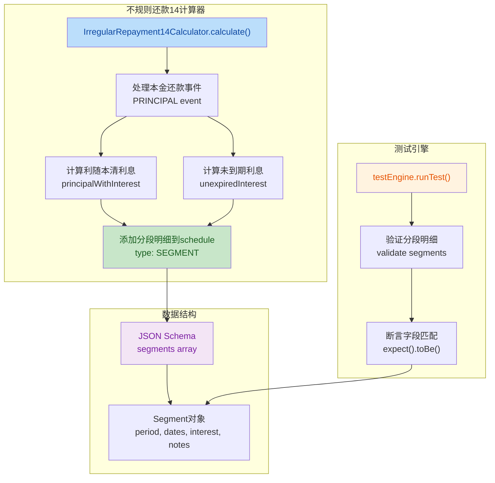
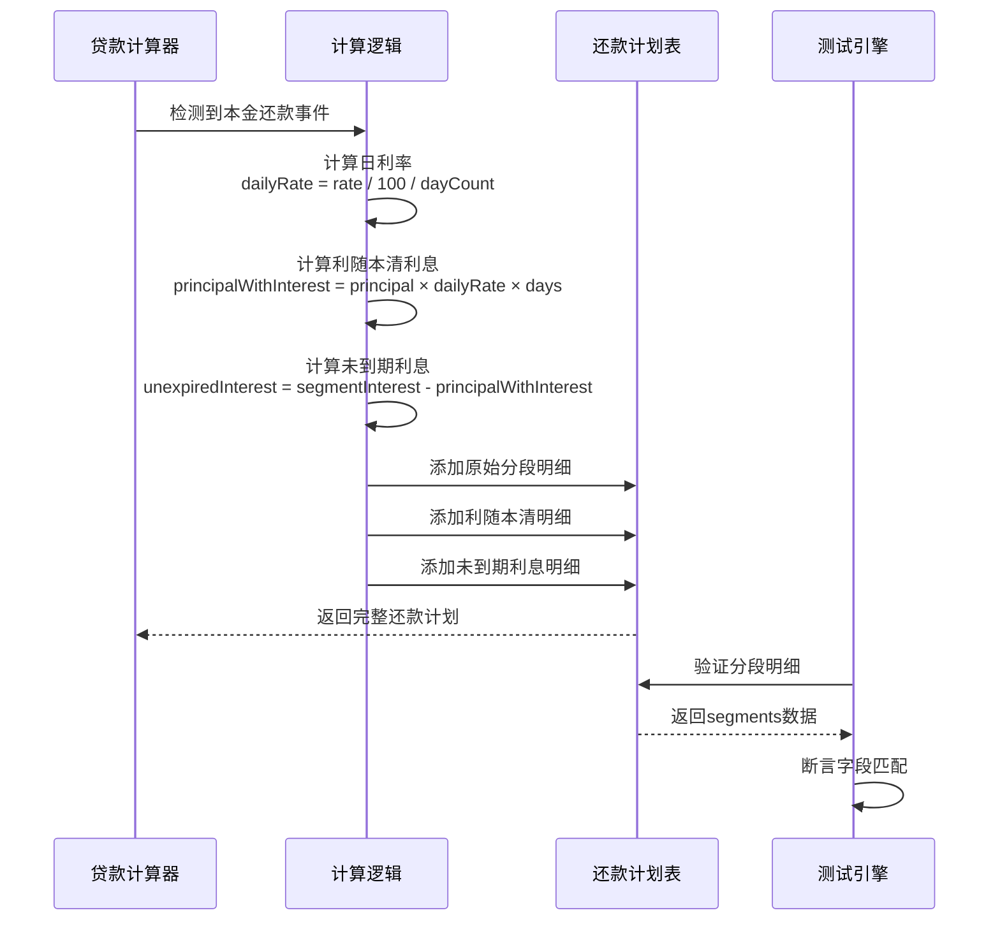

## 1. 高层摘要 (TL;DR)

*   **影响范围**: 🟡 **中等** - 为不规则还款14计算器添加了分段明细展示功能，涉及核心计算逻辑、测试框架和国际化
*   **核心变更**:
    *   ✨ 新增**利随本清**和**未到期利息**的分段明细计算逻辑
    *   🧪 扩展测试引擎，支持分段明细验证
    *   🌐 添加中英文翻译支持
    *   📋 更新JSON Schema以支持新的分段数据结构

---

## 2. 可视化概览 (代码与逻辑映射)





---

## 3. 详细变更分析

### 📊 组件 1: 核心计算逻辑增强

**文件**: `services/calculators/irregularRepayment14Calculator.ts`

**变更说明**:
在处理本金还款事件时，新增了分段明细的拆分逻辑。当检测到本金还款且非贷款到期日时，将原始分段利息拆分为两部分展示。

**核心算法**:
```typescript
// 计算日利率
const dailyRate = params.initialRate / 100 / params.dayCountConvention;

// 计算利随本清利息（还款本金对应的利息）
const dailyInterest = principalPayment * dailyRate;
const principalWithInterest = dailyInterest * segmentDaysCounter;

// 计算未到期利息（剩余本金对应的利息）
const unexpiredInterest = segmentInterest - principalWithInterest;
```

**新增分段明细结构**:

| 字段 | 类型 | 说明 | 示例值 |
|------|------|------|--------|
| `type` | string | 固定为 `'SEGMENT'` | `"SEGMENT"` |
| `period` | integer | 期数 | `3` |
| `segmentStartDate` | string | 分段开始日期 | `"2026-05-10"` |
| `segmentEndDate` | string | 分段结束日期 | `"2026-05-18"` |
| `daysCount` | integer | 天数 | `8` |
| `principal` | number | 本金（分段明细中为0） | `0` |
| `interest` | number | 利息 | `32.88` |
| `outstandingBalance` | number | 剩余本金 | `100000` |
| `notes` | string[] | 备注信息 | `["利随本清", "基数: $30000.00"]` |

---

### 🧪 组件 2: 测试引擎扩展

**文件**: `__tests__/test-engine/testEngine.ts`

**变更说明**:
1. **语言切换**: 测试引擎默认语言从 `'en'` 改为 `'cn'`
2. **分段验证**: 新增分段明细的验证逻辑，支持对 `SEGMENT` 类型记录的断言

**新增验证逻辑**:
```typescript
// 验证分段明细
if (testData.expected.segments) {
  testData.expected.segments.forEach((expectedSegment: any, index: number) => {
    const actualSegments = result.schedule.filter(
      (item: any) => item.period === expectedSegment.period && item.type === 'SEGMENT'
    );
    
    // 断言各个字段
    expect(actualSegment.segmentStartDate).toBe(expectedSegment.segmentStartDate);
    expect(actualSegment.interest).toBeCloseTo(expectedSegment.interest, 2);
    expect(actualSegment.notes).toEqual(expectedSegment.notes);
  });
}
```

---

### 📋 组件 3: JSON Schema 更新

**文件**: `__tests__/test-engine/schema.json`

**变更说明**:
在还款计划详情对象中新增 `segments` 字段定义，用于验证分段明细数据结构。

**Schema 结构**:
```json
{
  "segments": {
    "type": "array",
    "items": {
      "type": "object",
      "properties": {
        "period": { "type": "integer", "minimum": 1 },
        "segmentStartDate": { "type": "string" },
        "segmentEndDate": { "type": "string" },
        "daysCount": { "type": "integer", "minimum": 1 },
        "principal": { "type": "number", "minimum": 0 },
        "interest": { "type": "number", "minimum": 0 },
        "outstandingBalance": { "type": "number", "minimum": 0 },
        "notes": { "type": "array", "items": { "type": "string" } }
      },
      "required": ["period", "segmentStartDate", "segmentEndDate", "daysCount", "interest"]
    }
  }
}
```

---

### 🌐 组件 4: 国际化翻译

**文件**: `translations.ts`

**新增翻译键**:

| 键名 | 英文 | 中文 | 说明 |
|------|------|------|------|
| `principalWithInterest` | "Principal with Interest" | "利随本清" | 本金还款时对应的利息 |
| `unexpiredInterest` | "Unexpired Interest" | "未到期利息" | 剩余本金对应的利息 |

---

### 📝 组件 5: 测试用例新增

**文件**: `__tests__/test-data/repayment-scheme/irregular-repayment-14-segment-detail.md`

**测试场景**:
- **贷款金额**: 100,000
- **年利率**: 5%
- **期限**: 12个月
- **本金还款**: 2026-05-18 归还 30,000

**预期分段明细**:

| 类型 | 日期范围 | 天数 | 基数 | 利息 | 备注 |
|------|----------|------|------|------|------|
| 原始分段 | 2026-05-10 ~ 2026-05-18 | 8 | $100,000 | $109.59 | 基数: $100000.00 |
| 利随本清 | 2026-05-10 ~ 2026-05-18 | 8 | $30,000 | $32.88 | 利随本清, 基数: $30000.00 |
| 未到期利息 | 2026-05-10 ~ 2026-05-18 | 8 | $70,000 | $76.71 | 基数: $70000.00, 未到期利息 |

**计算验证**:
- 利随本清利息: `30,000 × (5% ÷ 365) × 8 = 32.88`
- 未到期利息: `109.59 - 32.88 = 76.71`
- 验证: `32.88 + 76.71 = 109.59` ✅

---

## 4. 影响与风险评估

### ⚠️ 破坏性变更
*   **无破坏性变更** - 本次变更为纯功能增强，向后兼容

### 🔍 测试建议
1. **功能测试**:
   - ✅ 验证本金还款时正确生成3个分段明细（原始、利随本清、未到期）
   - ✅ 验证利息计算精度（保留2位小数）
   - ✅ 验证利随本清 + 未到期利息 = 原始分段利息

2. **边界测试**:
   - ✅ 测试剩余本金 ≤ 0.005 时不生成未到期利息明细
   - ✅ 测试未到期利息 ≤ 0.005 时不生成未到期利息明细
   - ✅ 测试贷款到期日还款时不生成分段明细

3. **国际化测试**:
   - ✅ 验证中英文备注显示正确
   - ✅ 验证数字格式化（货币符号、千分位）

### 📌 注意事项
- 分段明细仅在 **本金还款事件** 且 **非贷款到期日** 时生成
- 使用 `toBeCloseTo(value, 2)` 进行浮点数比较，精度为2位小数
- 分段明细按顺序添加：原始分段 → 利随本清 → 未到期利息

---